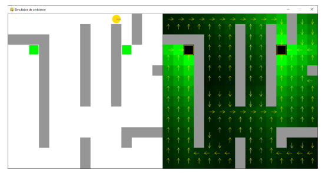

# Artificial Intelligence for Autonomous Systems 🤖

## Project Overview 📝

The project aims
to introduce students to the development of autonomous agents using different paradigms of artificial intelligence.
It was a key evaluation point of the [Artificial Intelligence for Autonomous Systems](https://www.isel.pt/en/leim/artificial-intelligence-autonomous-systems) course in the [CSE](https://www.isel.pt/en/curso/bsc-degree/computer-science-and-computer-engineering) undergraduate program of [ISEL](https://www.isel.pt/en).

 The project is divided into three main parts,
 each focusing on a different type of agent: reactive,
 [deliberative](https://en.wikipedia.org/wiki/Deliberative_agent) using [state space search](https://en.wikipedia.org/wiki/State_space_search), and deliberative using [Markov Decision Processes](https://en.wikipedia.org/wiki/Markov_decision_process).
 The environment is a 2D grid with fixed dimensions that can be configured to add or retract complexity. The agent moves in four directions (up, down, left, right) and can detect obstacles and objects in its vicinity. Agents are evaluated based on their performance in avoiding obstacles and targeting objects.

|  |
|:--------------------------------------------------------:|
|                  *Environment Example*                   |

> [!IMPORTANT]
> This overview is a brief summary of the project.
> For a more detailed explanation,
> please refer to the [Project Report](report/out/main.pdf),
> which contains a comprehensive analysis of the project's development, technical documentation, and results.
> Be aware that the report is written in **Portuguese**.

## Agents 🤖

Each following agent has a short embedded demonstration video showcasing its behavior in the environment in a specific configuration.

### Reactive Agent ⚡

https://github.com/user-attachments/assets/d5197dba-a825-450f-bae7-74128defaee6

### Deliberative Agent using State Space Search 🔍

https://github.com/user-attachments/assets/0f2c10af-a4d3-4ca2-b963-91eb7486ee51

### Deliberative Agent using Markov Decision Processes 🎲

https://github.com/user-attachments/assets/0acb2d5f-75fa-4791-a99f-1b7b390d81a8

## How to Run 🚀

1. Clone the repository:
2. Install:
   - Python 3.11 or higher (check with `python --version`)
   - Pygame (install with `pip install pygame`)
3. Activate the type of agent you want to run by commenting/uncommenting the corresponding line in the `iasa49428/iasa_agente/src/teste.py` file.
4. Navigate to the project's `iasa_agente` directory.
5. Run the following command to start the simulation:
    ```bash
    set PYTHONPATH=src;src\lib
    python src/teste.py
    ```

---

Instituto Superior de Engenharia de Lisboa<br>
BSc in Computer Science and Engineering<br>
Artificial Intelligence for Autonomous Systems<Br>
Summer Semester of 2023/2024
